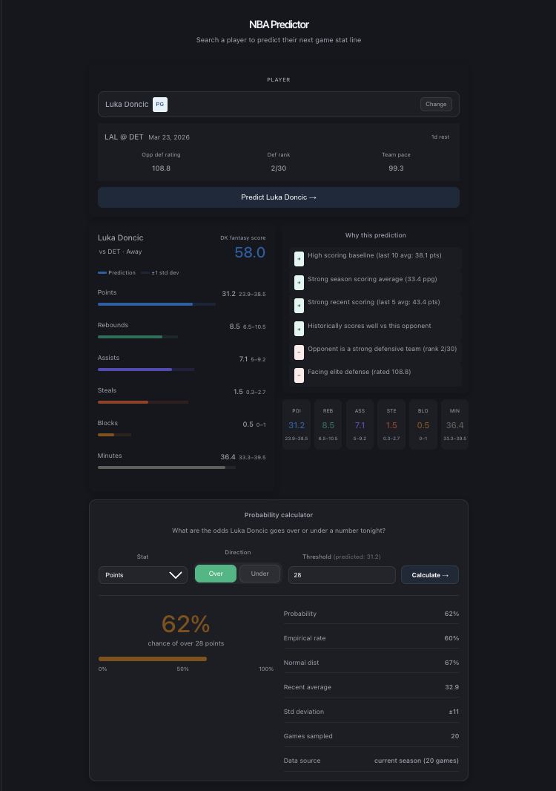

# 🏀 NBA Player Predictor

A machine learning-powered application that predicts an NBA player's next game performance using advanced statistical modeling and real-world data pipelines.

Built for fantasy basketball players, sports bettors, and data enthusiasts, this tool provides **stat predictions, confidence ranges, and probability insights** for upcoming games.

---

## 🚀 Features

- 🔮 Predicts next-game player stats:
  - Points, Rebounds, Assists
  - Steals, Blocks, Minutes
  - Fantasy Score

- 📊 Confidence intervals  
  - Predictions include a **±1 standard deviation range**

- 📈 Probability calculator  
  - Calculate the probability a player goes **over/under a stat line**

- 🧠 Explainable AI (SHAP)
  - Understand *why* a prediction was made
  - Feature-level contribution insights

- ⚡ Real-time data integration
  - Fetches latest player stats and upcoming matchups

---

## 🧠 Problem & Motivation

Predicting player performance in the NBA is complex due to:
- Game-to-game variance
- Opponent strength
- Player usage and role changes
- Schedule fatigue and rest days

This project aims to **quantify player performance probabilistically**, giving users a **data-driven edge** in fantasy sports and betting scenarios.

---

## 🏗️ Tech Stack

### Backend / ML
- Python
- XGBoost
- SHAP
- pandas, scikit-learn
- FastAPI
- BeautifulSoup

### Data Sources
- Basketball Reference (scraping)
- NBA API
- balldontlie API

### Frontend
- React (Vite)

### Visualization
- matplotlib

---

## 🧪 Model Details

- **Model:** XGBoost (Gradient Boosting)
- **Outputs:**
  - Points, rebounds, assists, steals, blocks, minutes, fantasy score

### Features Used
- Player stats:
  - Usage rate (USG%)
  - Rolling averages (recent performance)
  - Season averages
  - Performance vs specific opponents
  - Rest days / fatigue

- Team & context stats:
  - Team pace
  - Opponent pace
  - Defensive rating & rank
  - Opponent stats allowed by position

- Advanced engineered features:
  - Trend indicators
  - Efficiency metrics
  - Game context
  - Schedule timing
  - Starter status

---

## ⚙️ Pipeline

1. **Data Collection**
   - Player game logs scraped from Basketball Reference
   - Team stats from NBA API
   - Upcoming games via balldontlie API

2. **Feature Engineering**
   - True usage rate calculation  
   - Rolling averages & trends  
   - Opponent-specific performance  
   - Fatigue and schedule features  
   - Position-based defensive matchups  

3. **Model Training**
   - XGBoost models per stat
   - Hyperparameter tuning based on stat type:
     - High-signal (PTS/REB/AST): deeper trees
     - Low-signal (STL/BLK): stronger regularization
     - Minutes: constrained due to variability

4. **Prediction & Explainability**
   - SHAP used for feature importance
   - Generates reasoning behind predictions
   - Computes prediction ranges and warnings

---

## 📊 Results

- **Rebounds & Assists:** highest relative accuracy
- **Blocks & Steals:** lowest variance (rare events)
- **Points & Minutes:** consistently within prediction confidence intervals

Metrics used:
- MAE (Mean Absolute Error)
- RMSE (Root Mean Squared Error)
- R² Score

---

## 🚀 Getting Started

### 1. Clone the repo

git clone https://github.com/YOUR_USERNAME/nba-player-predictor.git
cd nba-player-predictor

### 2. Backend Setup

pip install -r requirements.txt
uvicorn api.main:app --reload

### 3. Frontend Setup

cd dashboard
npm install
npm run dev

---

## 📁 Project Structure
```
nba-player-predictor/
├── api/
│   ├── __init__.py
│   ├── main.py                       # FastAPI app entrypoint
│   └── routers/
│       ├── __init__.py
│       └── predict.py                # Prediction endpoints
├── assets/
│   └── screenshot.png                # App preview image
├── dashboard/
│   ├── index.html
│   ├── package.json
│   ├── public/
│   ├── src/                          # React (Vite) frontend
│   └── vite.config.js
├── explainability/
│   ├── __init__.py
│   └── shap_explainer.py             # SHAP-based prediction reasoning
├── features/
│   ├── __init__.py
│   ├── build_dataset.py              # Builds training dataset
│   ├── engineer.py                   # Feature engineering
│   └── feature_config.py
├── models/
│   ├── __init__.py
│   ├── evaluate.py                   # Model evaluation (MAE/RMSE/R²)
│   ├── predict.py                    # Load model + run predictions
│   └── train.py                      # XGBoost training
├── notebooks/                        # Exploratory analysis
├── scraping/
│   ├── __init__.py
│   ├── bbref_scraper.py              # Basketball Reference scraper
│   ├── nba_api_client.py             # NBA API client
│   └── next_game.py                  # Upcoming matchup lookup
├── config.py
├── requirements.txt
└── README.md
```

---

## 🔍 Example Output

- Predicted stats with confidence ranges  
- SHAP-based reasoning:
  - "High scoring baseline (last 10 avg: 21.3 pts)"
  - "Opponent weak defensive rating"
- Probability calculation:
  - "63% chance of scoring over 20 points"

---

## 🖥️ Application Preview



---

## 💡 Future Improvements

- 🐳 Docker containerization  
- ☁️ Cloud deployment (AWS / GCP)  
- 🏥 Injury-aware modeling  
- 📡 Live updating predictions  
- 📊 Betting edge detection  

---

## ⚠️ Disclaimer

This tool is for educational and analytical purposes only.  
Predictions are probabilistic and should not be considered guaranteed outcomes.

---

## 👤 Author

Arjun Bharadwaj  
GitHub: https://github.com/ArjunBharadwaj123
