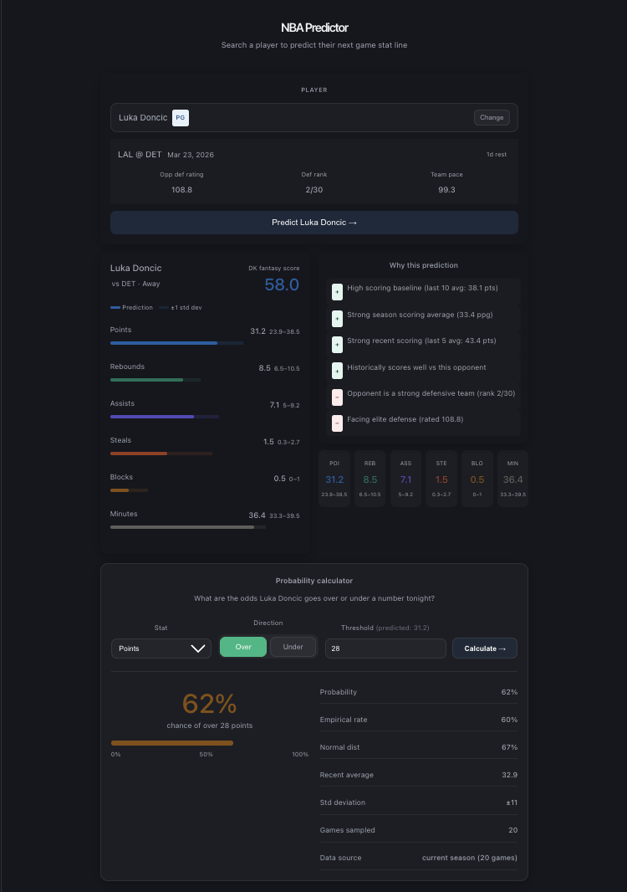

# 🏀 NBA Player Predictor

A machine learning-powered application that predicts an NBA player's next game performance using advanced statistical modeling and real-world data pipelines.

Built for fantasy basketball players, sports bettors, and data enthusiasts, this tool provides **stat predictions, confidence ranges, and probability insights** for upcoming games.

---

## 🚀 Features

- 🔮 Predicts next-game player stats:
  - Points, Rebounds, Assists
  - Steals, Blocks, Minutes
  - Fantasy Score

- 📊 Confidence intervals  
  - Predictions include a **±1 standard deviation range**

- 📈 Probability calculator  
  - Calculate the probability a player goes **over/under a stat line**

- 🧠 Explainable AI (SHAP)
  - Understand *why* a prediction was made
  - Feature-level contribution insights

- ⚡ Real-time data integration
  - Fetches latest player stats and upcoming matchups

---

## 🧠 Problem & Motivation

Predicting player performance in the NBA is complex due to:
- Game-to-game variance
- Opponent strength
- Player usage and role changes
- Schedule fatigue and rest days

This project aims to **quantify player performance probabilistically**, giving users a **data-driven edge** in fantasy sports and betting scenarios.

---

## 🏗️ Tech Stack

### Backend / ML
- Python
- XGBoost
- SHAP
- pandas, scikit-learn
- FastAPI
- BeautifulSoup

### Data Sources
- Basketball Reference (scraping)
- NBA API
- balldontlie API

### Frontend
- React (Vite)

### Visualization
- matplotlib

---

## 🧪 Model Details

- **Model:** XGBoost (Gradient Boosting)
- **Outputs:**
  - Points, rebounds, assists, steals, blocks, minutes, fantasy score

### Features Used
- Player stats:
  - Usage rate (USG%)
  - Rolling averages (recent performance)
  - Season averages
  - Performance vs specific opponents
  - Rest days / fatigue

- Team & context stats:
  - Team pace
  - Opponent pace
  - Defensive rating & rank
  - Opponent stats allowed by position

- Advanced engineered features:
  - Trend indicators
  - Efficiency metrics (TS%, points-per-minute)
  - Recency-weighted (EWMA) form
  - Home/away form splits
  - Matchup interactions (opponent pace, combined game pace, usage × minutes)
  - **Projected minutes fed into the counting-stat models** (minutes stacking)
  - Game context, schedule timing, starter status

---

## ⚙️ Pipeline

1. **Data Collection**
   - Player game logs scraped from Basketball Reference
   - Team stats from NBA API
   - Upcoming games via balldontlie API

2. **Feature Engineering**
   - True usage rate calculation  
   - Rolling averages & trends  
   - Opponent-specific performance  
   - Fatigue and schedule features  
   - Position-based defensive matchups  

3. **Model Training**
   - One XGBoost model per stat, tuned with 5-fold `TimeSeriesSplit` CV
   - Hyperparameters chosen from evidence via `models/tune.py` (MAE/R² sweep
     graphs in `reports/tuning/`) — shallow trees (`max_depth=3`) generalise
     best on noisy game-level data
   - Minutes is trained first; its out-of-fold projection is fed to the
     counting-stat models (leakage-free stacking)
   - Two extra quantile models per stat (p15 / p85) for calibrated intervals

4. **Prediction & Explainability**
   - SHAP used for per-prediction feature attribution and reasoning strings
   - Calibrated p15–p85 quantile prediction ranges (asymmetric, minutes-aware)
   - Warnings for load-management / back-to-back / thin data

---

## 📊 Results

Backtested on a **chronological holdout** (train on the earliest games, test on
the most recent 15% — never on the future) via `models/evaluate.py`:

| Stat    | MAE   | RMSE  | R²    | Interval coverage |
|---------|-------|-------|-------|-------------------|
| Points  | 5.44  | 6.98  | 0.50  | 68%               |
| Rebounds| 2.17  | 2.83  | 0.51  | 68%               |
| Assists | 1.66  | 2.20  | 0.52  | 69%               |
| Steals  | 0.78  | 0.99  | 0.07  | 82%               |
| Blocks  | 0.61  | 0.82  | 0.21  | 81%               |
| Minutes | 4.10  | 5.44  | 0.58  | 70%               |

- **Points / Rebounds / Assists / Minutes:** the most predictable stats; R² ≈ 0.5
  is strong for *game-level* NBA prediction, where game-to-game variance is high.
- **Steals / Blocks:** rare, near-random events — low R² is inherent, so the
  models correctly stay close to the mean and their intervals over-cover.
- **Prediction intervals** land near the 70% target for the main stats — the
  bands are calibrated, not cosmetic.

Metrics: MAE (Mean Absolute Error), RMSE (Root Mean Squared Error), R² Score, and
interval coverage. Re-generate anytime with `python models/evaluate.py`.

---

## 🚀 Getting Started

### 1. Clone the repo

git clone https://github.com/YOUR_USERNAME/nba-player-predictor.git
cd nba-player-predictor

### 2. Backend Setup

pip install -r requirements.txt
uvicorn api.main:app --reload

### 3. Frontend Setup

cd dashboard
npm install
npm run dev

---

## 📁 Project Structure
```
├── README.md
├── api
│   ├── __init__.py
│   └── main.py                  # FastAPI prediction server
├── config.py
├── dashboard                    # React (Vite) frontend
│   ├── index.html
│   ├── package.json
│   └── src
├── data
│   ├── processed                # training_dataset, features, roster.json
│   └── raw                      # scraped game logs, team stats, schedules
├── docs
│   └── TECHNICAL_OVERVIEW.md     # full technical breakdown
├── explainability
│   └── shap_explainer.py         # predictions + SHAP reasoning + quantile bands
├── features
│   ├── build_dataset.py
│   └── engineer.py               # feature engineering
├── models
│   ├── train.py                  # trains point + quantile models
│   ├── tune.py                   # hyperparameter sweep + MAE/R² graphs
│   ├── evaluate.py               # chronological-holdout backtest
│   └── saved                     # *.pkl models + training_metadata.json
├── pipeline
│   └── update.py                 # in-season re-scrape + retrain
├── reports
│   └── tuning                    # hyperparameter sweep charts
├── requirements.txt
└── scraping
    ├── bbref_scraper.py          # game logs + roster auto-collection
    ├── nba_api_client.py         # team pace / defense / schedule
    └── next_game.py              # live next-game context + injuries
```

---

## 🔍 Example Output

- Predicted stats with confidence ranges  
- SHAP-based reasoning:
  - "High scoring baseline (last 10 avg: 21.3 pts)"
  - "Opponent weak defensive rating"
- Probability calculation:
  - "63% chance of scoring over 20 points"

---

## 🖥️ Application Preview



---

## 💡 Future Improvements

- 🐳 Docker containerization  
- ☁️ Cloud deployment (AWS / GCP)  
- 🏥 Injury-aware modeling  
- 📡 Live updating predictions  
- 📊 Betting edge detection  

---

## ⚠️ Disclaimer

This tool is for educational and analytical purposes only.  
Predictions are probabilistic and should not be considered guaranteed outcomes.

---

## 👤 Author

Arjun Bharadwaj  
GitHub: https://github.com/ArjunBharadwaj123