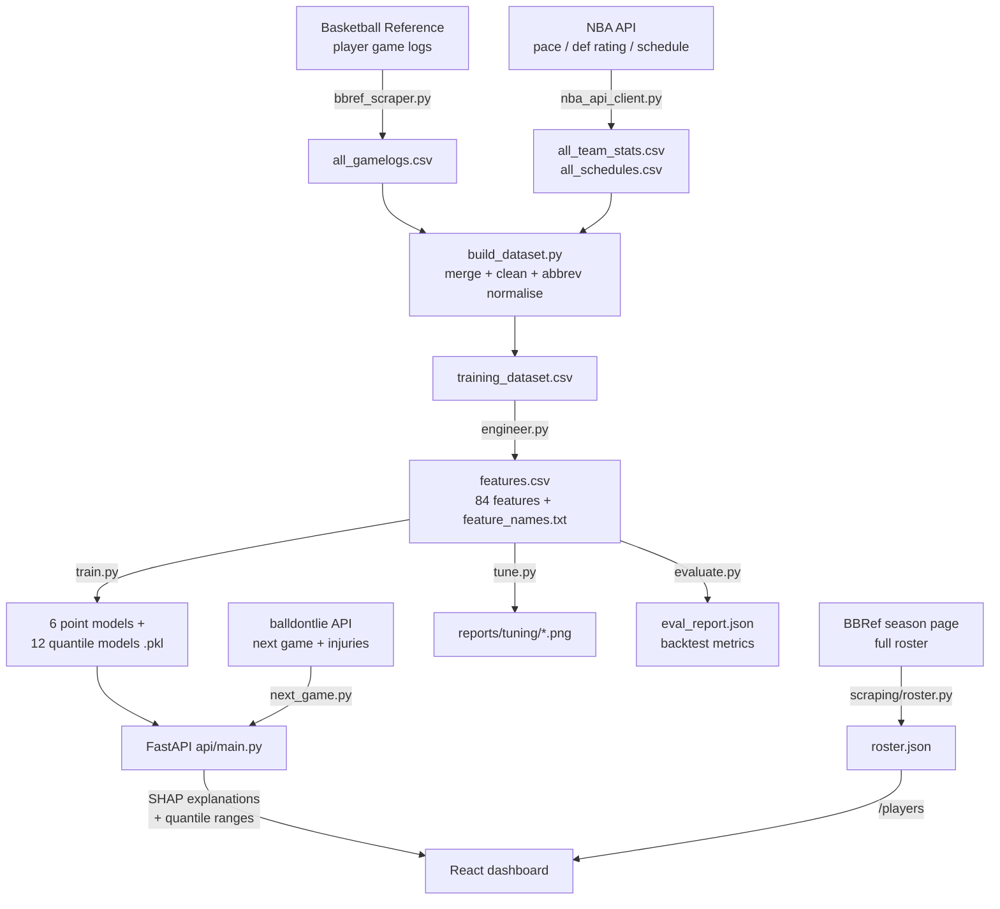

# NBA Player Predictor — Technical Overview

A complete, interview-ready walkthrough of how this project works end to end:
how data is collected, how features are engineered, how the models are trained
and tuned, how predictions are served and explained, and how to talk about the
design trade-offs.

---

## 1. What it does (one paragraph)

Given an NBA player and their next scheduled game, the system predicts a full
stat line — **points, rebounds, assists, steals, blocks, minutes** — plus a
DraftKings **fantasy score**, a **calibrated range** for each stat, a
**plain-English explanation** of the prediction, and an **over/under probability**
for any threshold. It's a full pipeline: scrape → merge → engineer features →
train per-stat models → serve via an API → render in a React dashboard.

---

## 2. Architecture & full workflow



**Reproduce each stage** (commands are the source of truth):

```bash
# 1. Collect data (network; cached HTML makes re-runs fast)
python scraping/roster.py                 # build data/processed/roster.json
python scraping/bbref_scraper.py --mode train
python scraping/nba_api_client.py --mode all

# 2. Merge + engineer
python features/build_dataset.py          # -> data/processed/training_dataset.csv
python features/engineer.py               # -> features.csv + feature_names.txt

# 3. Tune, train, evaluate
python models/tune.py --stat pts --param max_depth   # sweep graphs (optional)
python models/train.py                    # -> models/saved/*.pkl
python models/evaluate.py --stack-minutes # -> eval_report.json (backtest)

# 4. Serve
uvicorn api.main:app --reload             # http://localhost:8000
cd dashboard && npm install && npm run dev # http://localhost:5173

# 5. Keep it current (in-season)
python pipeline/update.py                 # re-scrape + retrain if new games exist
```

---

## 3. How the data is scraped

### 3a. Player game logs — Basketball Reference (`scraping/bbref_scraper.py`)
- One request per player-season, e.g. `.../players/j/jamesle01/gamelog/2025`.
- **The key trick:** BBRef ships secondary tables *inside HTML comments* to slow
  scrapers. `_extract_table_html()` handles all three cases — a live DOM table,
  a comment-wrapped table found by regex on the raw HTML, and a BeautifulSoup
  `Comment`-node fallback.
- **Anti-block hygiene:** a `cloudscraper` session with browser headers, a warm-up
  request, a `Referer` per player, ~4 s + jitter between requests, and retry/backoff
  on 403 (re-warm) / 429 (60 s sleep) / timeouts.
- **Caching:** every page is saved to `data/raw/html/{player_id}_{season}.html`, so
  re-runs are disk-fast and don't re-hit the site.

### 3b. Roster — auto-collected (`scraping/roster.py`)
Instead of a hand-typed player list, this parses BBRef's season **per-game page**
(`.../leagues/NBA_{season}_per_game.html`), which lists *every* player who played
that season with their exact BBRef IDs. It filters to meaningful players
(≥ 20 games, ≥ 15 mpg), dedupes traded players (keeps the combined-team row),
and writes `data/processed/roster.json`. This drives the scrape and feeds the
frontend's player search, so the two never drift apart.

### 3c. Team context — NBA API (`scraping/nba_api_client.py`)
Per team-season: **pace**, offensive/defensive rating, defensive rank, plus
per-game **rest days / back-to-back** flags from the schedule, and
**points allowed per position** (`opp_pos_defense.csv`).

### 3d. Live next game + injuries (`scraping/next_game.py`)
The **balldontlie API** resolves a player's next scheduled game; the NBA API adds
opponent pace/def rating, rest, and injury status. Returned to the API as the
`/predict` payload plus underscore-prefixed metadata (`_game_date`,
`_injury_status`, …).

### 3e. Merge & clean (`features/build_dataset.py`)
Joins game logs to schedule context on team+date, **normalising BBRef→NBA-API
team abbreviations** (e.g. `BRK→BKN`, `PHO→PHX`), and produces
`training_dataset.csv` (~26 k player-games, seasons 2022–2025).

---

## 4. Feature engineering (`features/engineer.py`) — 84 features

The golden rule everywhere: **every rolling/season feature uses `.shift(1)`** so a
row only ever sees games *before* it — no target leakage.

| Group | Examples | Why |
|-------|----------|-----|
| Rolling averages (3/5/10) | `rolling_last10_pts`, `rolling_last5_minutes` | recent form at multiple horizons |
| **EWMA form** (halflife 3) | `ewm_pts`, `ewm_ast` | recency-weighted — reacts to hot/cold streaks faster than a flat window |
| Season averages | `season_avg_pts` | stable baseline |
| **Home/away split** | `venue_last10_pts` | some players are meaningfully better at home |
| Trend | `trend_pts` (= last3 / last10) | is the player heating up or cooling off |
| Efficiency | `ts_pct`, `rolling_last5_pts_per_min`, `rolling_last5_minutes_std` | scoring efficiency + minutes volatility |
| Usage | true `usage_rate` = `(FGA + 0.44·FTA + TOV) / (min/48 · pace)` | share of possessions used on court |
| **Matchup interactions** | `opp_pace`, `pace_sum`, `usage_x_minutes` | total-possession environment; opportunity = usage × minutes |
| Opponent | `opp_def_rating`, `opp_def_rank`, `opp_pts_allowed_pos` | strength & positional matchup |
| Schedule | `rest_days_capped`, `back_to_back`, `games_in_last_7_days`, `season_phase` | fatigue & load management |
| Role | `is_likely_starter`, `start_rate_last10` | starter vs bench minutes |
| Opponent history | `vs_opp_rolling3_pts` | how this player has done vs this opponent |

After this work, the **EWMA and interaction features became the model's primary
signals** — `ewm_pts` is the single most important feature for points, and
`usage_x_minutes` is top-3 — replacing the flat rolling averages as the dominant
form indicator.

---

## 5. Model design

- **Six independent `XGBRegressor` models**, one per stat. Separate models let
  each stat get its own features/regularisation (a block model shares nothing
  useful across, say, blocks and assists).
- **Minutes stacking:** minutes is trained **first**, and its **out-of-fold**
  prediction (`pred_minutes`, leakage-free via `TimeSeriesSplit`) is fed as a
  feature to the five counting-stat models — because counting stats are roughly
  *rate × minutes*.
- **Quantile models:** two extra XGBoost models per stat
  (`objective="reg:quantileerror"`, α = 0.15 / 0.85) give a calibrated p15–p85
  **prediction interval** instead of a naive ± standard deviation.
- **Validation:** 5-fold **`TimeSeriesSplit`** — always train on the past, test on
  the future. Random k-fold would leak future games into training and inflate
  the scores.

### Best hyperparameters per model

Chosen from evidence with `models/tune.py`. The full calibration set —
**every hyperparameter swept for every model** — lives in
`reports/tuning/<stat>/`, each chart labelling the exact CV MAE and R² at every
value (regenerate with `python models/tune.py --stat all --param all`). The
clearest finding: on this noisy, game-level data **shallow trees (`max_depth=3`)
generalise best across every stat** — deeper trees overfit.

| Stat | n_estimators | learning_rate | max_depth | min_child_weight | subsample | colsample | reg_α | reg_λ |
|------|-------------:|--------------:|----------:|-----------------:|----------:|----------:|------:|------:|
| pts / reb / ast | 600 | 0.04 | 3 | 4 | 0.80 | 0.75 | 0.1 | 1.5 |
| stl / blk | 400 | 0.03 | 3 | 10 | 0.70 | 0.60 | 1.0 | 3.0 |
| minutes | 500 | 0.03 | 3 | 8 | 0.75 | 0.70 | 0.5 | 2.0 |

Reasoning: **high-signal stats** (pts/reb/ast) get more trees and lighter
regularisation; **low-signal rare events** (stl/blk) get heavy regularisation
(`min_child_weight=10`, higher `reg_α/λ`) so the model doesn't chase noise;
**minutes** sits in between (load-management variance). All use early stopping.

---

## 6. Accuracy — measured on a chronological holdout

`models/evaluate.py` trains on the earliest games and tests on the **most recent
15%** (never on the future), reporting point accuracy *and* interval calibration.

| Stat | MAE | RMSE | R² | Interval coverage |
|------|----:|-----:|---:|------------------:|
| Points  | 5.44 | 6.98 | 0.50 | 68% |
| Rebounds| 2.17 | 2.83 | 0.51 | 68% |
| Assists | 1.66 | 2.20 | 0.52 | 69% |
| Steals  | 0.78 | 0.99 | 0.07 | 82% |
| Blocks  | 0.61 | 0.82 | 0.21 | 81% |
| Minutes | 4.10 | 5.44 | 0.58 | 70% |

**How to read it:**
- **MAE** is in the stat's own units — a points MAE of ~5.4 means the prediction
  lands within ~5 points of the actual, on average. For *game-level* NBA scoring
  (nightly variance is huge), **R² ≈ 0.5 is genuinely strong**.
- **Steals/blocks** are near-random game to game, so their R² is inherently low.
  The model correctly stays close to the mean rather than chasing noise — which
  is also why their intervals *over*-cover (82% vs the 70% target).
- **Interval coverage** for the main stats lands right around the **70% target**
  for a p15–p85 band, i.e. the ranges are calibrated, not decorative.

**What the improvements did (before → after):** minutes-stacking, EWMA/venue/
interaction features, and depth-3 tuning nudged the main stats up
(pts R² 0.493 → 0.495, ast 0.515 → 0.520, minutes coverage 69% → 70%) and, just
as importantly, replaced the flat rolling averages with recency-weighted EWMA as
the model's top signal and delivered **calibrated, asymmetric, minutes-aware
intervals**. The honest headline: **point accuracy is near the achievable ceiling
for this problem/feature family; the durable wins are the calibrated intervals,
the matchup features, and the tuning + backtest + continuous-learning
infrastructure that lets accuracy keep improving as data grows.**

---

## 7. Serving & explainability

`POST /predict` flow (`api/main.py` → `explainability/shap_explainer.py`):

1. **Build the feature row** — start from the player's latest engineered row
   (guarantees all 84 columns exist), overlay freshly-scraped current-season
   rolling averages, then override tonight's context (opponent, home/away, rest,
   pace, positional defense).
2. **Predict minutes first**, write it back as `pred_minutes`, then predict the
   counting stats — mirroring the training-time stacking (never uses actual
   minutes). Each model self-describes its columns via `feature_names_in_`.
3. **SHAP** (`TreeExplainer`) attributes each prediction to its features; the top
   contributions become +/− reasoning strings ("Strong season scoring average
   (24.6 ppg)", "Projected for heavy minutes (34 proj)"). Labels are matched
   **exactly** by feature name (a substring bug used to mislabel
   `rolling_last5_pts_per_min` as "0.7 pts").
4. **Quantile models** produce the asymmetric p15–p85 range for each stat.
5. **Fantasy score** = `pts + 1.2·reb + 1.5·ast + 3·stl + 3·blk` (DraftKings).

Other endpoints: `GET /players` (the searchable roster with id+pos, straight from
`features.csv` so it stays in sync), `GET /next-game/{player}` (live context +
injuries), `GET /probability` (over/under, blending empirical hit-rate with a
normal-CDF estimate), `GET /health`.

---

## 8. Continuous learning (`pipeline/update.py`)

An **idempotent** in-season updater: refresh roster → scrape current-season logs
→ **merge new games into `all_gamelogs.csv`, deduped by (player_id, game_date)**
→ refresh team context → rebuild features → retrain → backtest. It only retrains
when new games actually arrived, and skips retraining (rather than corrupting the
dataset) if a network step fails. `eval_report.json` keeps a dated history so
accuracy drift is visible over time. Schedule it via cron / launchd / a GitHub
Actions `schedule:` workflow / the Claude Code `/schedule` skill.

---

## 9. Interview talking points (trade-offs to defend)

- **Why XGBoost?** Tabular, mixed-scale, non-linear features with interactions and
  missing values — gradient-boosted trees are the strong default; they handle
  NaNs natively and need no scaling.
- **Why per-stat models, not one multi-output model?** Each stat has different
  signal strength and wants different regularisation; separate models also let us
  stack minutes into the counting stats cleanly.
- **Why `TimeSeriesSplit`, not random k-fold?** Predicting the future from the
  past — random folds would leak later games into training and give optimistic,
  dishonest scores.
- **Why is steals' R² so low, and is that a bug?** No — steals are close to random
  game to game. A well-regularised model *should* predict near the mean; the low
  R² reflects the problem, not the model.
- **Minutes stacking** is theoretically clean (leakage-free OOF) and neutral-to-
  positive; its real value shows up when a player's role/minutes shift, where lagged
  rolling minutes are stale.
- **Quantile intervals vs ± std:** the old band was symmetric and ignored the
  model; quantile regression gives asymmetric, feature-aware, *calibrated* bands
  (~70% coverage, verified).
- **Honest limitations:** game-to-game variance caps point accuracy; there's no
  **teammate-injury / usage-redistribution** modeling yet (the biggest real-world
  swing — when a star sits, everyone else's usage jumps), and live predictions
  depend on scraper/API availability. The infrastructure (backtest, tuning,
  continuous retraining) is built so these can be added and *measured*.
