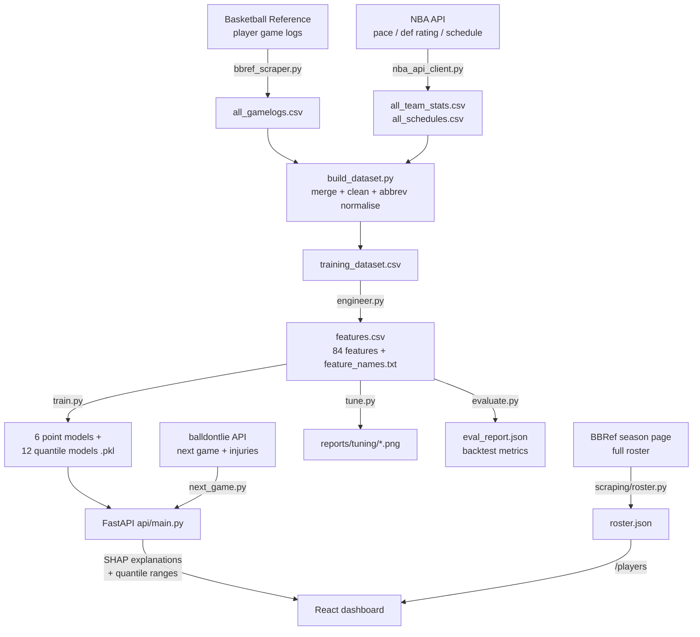

# NBA Player Predictor — Technical Overview

A complete, interview-ready walkthrough of how this project works end to end:
how data is collected, how features are engineered, how the models are trained
and tuned, how predictions are served and explained, and how to talk about the
design trade-offs.

---

## 1. What it does (one paragraph)

Given an NBA player and their next scheduled game, the system predicts a full
stat line — **points, rebounds, assists, steals, blocks, minutes** — plus a
DraftKings **fantasy score**, a **calibrated range** for each stat, a
**plain-English explanation** of the prediction, and an **over/under probability**
for any threshold. It's a full pipeline: scrape → merge → engineer features →
train per-stat models → serve via an API → render in a React dashboard.

---

## 2. Architecture & full workflow



**Reproduce each stage** (commands are the source of truth):

```bash
# NBA backend code now lives under nba/ (mirrors the nfl/ package).
# 1. Collect data (network; cached HTML makes re-runs fast)
python nba/scraping/roster.py             # build nba/data/processed/roster.json
python nba/scraping/bbref_scraper.py --mode train
python nba/scraping/nba_api_client.py --mode all

# 2. Merge + engineer
python nba/features/build_dataset.py      # -> nba/data/processed/training_dataset.csv
python nba/features/engineer.py           # -> features.csv + feature_names.txt

# 3. Tune, train, evaluate
python nba/models/tune.py --stat pts --param max_depth   # sweep graphs (optional)
python nba/models/train.py                # -> nba/models/saved/*.pkl
python nba/models/evaluate.py --stack-minutes # -> eval_report.json (backtest)

# 4. Serve
uvicorn api.main:app --reload             # http://localhost:8000
cd dashboard && npm install && npm run dev # http://localhost:5173

# 5. Keep it current (in-season)
python nba/pipeline/update.py             # re-scrape + retrain if new games exist
```

---

## 3. How the data is scraped

### 3a. Player game logs — Basketball Reference (`scraping/bbref_scraper.py`)
- One request per player-season, e.g. `.../players/j/jamesle01/gamelog/2025`.
- **The key trick:** BBRef ships secondary tables *inside HTML comments* to slow
  scrapers. `_extract_table_html()` handles all three cases — a live DOM table,
  a comment-wrapped table found by regex on the raw HTML, and a BeautifulSoup
  `Comment`-node fallback.
- **Anti-block hygiene:** a `cloudscraper` session with browser headers, a warm-up
  request, a `Referer` per player, ~4 s + jitter between requests, and retry/backoff
  on 403 (re-warm) / 429 (60 s sleep) / timeouts.
- **Caching:** every page is saved to `data/raw/html/{player_id}_{season}.html`, so
  re-runs are disk-fast and don't re-hit the site.

### 3b. Roster — auto-collected (`scraping/roster.py`)
Instead of a hand-typed player list, this parses BBRef's season **per-game page**
(`.../leagues/NBA_{season}_per_game.html`), which lists *every* player who played
that season with their exact BBRef IDs. It filters to meaningful players
(≥ 20 games, ≥ 15 mpg), dedupes traded players (keeps the combined-team row),
and writes `data/processed/roster.json`. This drives the scrape and feeds the
frontend's player search, so the two never drift apart.

### 3c. Team context — NBA API (`scraping/nba_api_client.py`)
Per team-season: **pace**, offensive/defensive rating, defensive rank, plus
per-game **rest days / back-to-back** flags from the schedule, and
**points allowed per position** (`opp_pos_defense.csv`).

### 3d. Live next game + injuries (`scraping/next_game.py`)
The **balldontlie API** resolves a player's next scheduled game; the NBA API adds
opponent pace/def rating, rest, and injury status. Returned to the API as the
`/predict` payload plus underscore-prefixed metadata (`_game_date`,
`_injury_status`, …).

### 3e. Merge & clean (`features/build_dataset.py`)
Joins game logs to schedule context on team+date, **normalising BBRef→NBA-API
team abbreviations** (e.g. `BRK→BKN`, `PHO→PHX`), and produces
`training_dataset.csv` (~26 k player-games, seasons 2022–2025).

---

## 4. Feature engineering (`features/engineer.py`) — 84 features

The golden rule everywhere: **every rolling/season feature uses `.shift(1)`** so a
row only ever sees games *before* it — no target leakage.

| Group | Examples | Why |
|-------|----------|-----|
| Rolling averages (3/5/10) | `rolling_last10_pts`, `rolling_last5_minutes` | recent form at multiple horizons |
| **EWMA form** (halflife 3) | `ewm_pts`, `ewm_ast` | recency-weighted — reacts to hot/cold streaks faster than a flat window |
| Season averages | `season_avg_pts` | stable baseline |
| **Home/away split** | `venue_last10_pts` | some players are meaningfully better at home |
| Trend | `trend_pts` (= last3 / last10) | is the player heating up or cooling off |
| Efficiency | `ts_pct`, `rolling_last5_pts_per_min`, `rolling_last5_minutes_std` | scoring efficiency + minutes volatility |
| Usage | true `usage_rate` = `(FGA + 0.44·FTA + TOV) / (min/48 · pace)` | share of possessions used on court |
| **Matchup interactions** | `opp_pace`, `pace_sum`, `usage_x_minutes` | total-possession environment; opportunity = usage × minutes |
| Opponent | `opp_def_rating`, `opp_def_rank`, `opp_pts_allowed_pos` | strength & positional matchup |
| Schedule | `rest_days_capped`, `back_to_back`, `games_in_last_7_days`, `season_phase` | fatigue & load management |
| Role | `is_likely_starter`, `start_rate_last10` | starter vs bench minutes |
| Opponent history | `vs_opp_rolling3_pts` | how this player has done vs this opponent |

After this work, the **EWMA and interaction features became the model's primary
signals** — `ewm_pts` is the single most important feature for points, and
`usage_x_minutes` is top-3 — replacing the flat rolling averages as the dominant
form indicator.

---

## 5. Model design

- **Six independent `XGBRegressor` models**, one per stat. Separate models let
  each stat get its own features/regularisation (a block model shares nothing
  useful across, say, blocks and assists).
- **Minutes stacking:** minutes is trained **first**, and its **out-of-fold**
  prediction (`pred_minutes`, leakage-free via `TimeSeriesSplit`) is fed as a
  feature to the five counting-stat models — because counting stats are roughly
  *rate × minutes*.
- **Quantile models:** two extra XGBoost models per stat
  (`objective="reg:quantileerror"`, α = 0.15 / 0.85) give a calibrated p15–p85
  **prediction interval** instead of a naive ± standard deviation.
- **Validation:** 5-fold **`TimeSeriesSplit`** — always train on the past, test on
  the future. Random k-fold would leak future games into training and inflate
  the scores.

### Best hyperparameters per model

Chosen from evidence with `models/tune.py`. The full calibration set —
**every hyperparameter swept for every model** — lives in
`reports/tuning/<stat>/`, each chart labelling the exact CV MAE and R² at every
value (regenerate with `python models/tune.py --stat all --param all`). The
clearest finding: on this noisy, game-level data **shallow trees (`max_depth=3`)
generalise best across every stat** — deeper trees overfit.

| Stat | n_estimators | learning_rate | max_depth | min_child_weight | subsample | colsample | reg_α | reg_λ |
|------|-------------:|--------------:|----------:|-----------------:|----------:|----------:|------:|------:|
| pts / reb / ast | 600 | 0.04 | 3 | 4 | 0.80 | 0.75 | 0.1 | 1.5 |
| stl / blk | 400 | 0.03 | 3 | 10 | 0.70 | 0.60 | 1.0 | 3.0 |
| minutes | 500 | 0.03 | 3 | 8 | 0.75 | 0.70 | 0.5 | 2.0 |

Reasoning: **high-signal stats** (pts/reb/ast) get more trees and lighter
regularisation; **low-signal rare events** (stl/blk) get heavy regularisation
(`min_child_weight=10`, higher `reg_α/λ`) so the model doesn't chase noise;
**minutes** sits in between (load-management variance). All use early stopping.

---

## 6. Accuracy — measured on a chronological holdout

`models/evaluate.py` trains on the earliest games and tests on the **most recent
15%** (never on the future), reporting point accuracy *and* interval calibration.

| Stat | MAE | RMSE | R² | Interval coverage |
|------|----:|-----:|---:|------------------:|
| Points  | 5.44 | 6.98 | 0.50 | 68% |
| Rebounds| 2.17 | 2.83 | 0.51 | 68% |
| Assists | 1.66 | 2.20 | 0.52 | 69% |
| Steals  | 0.78 | 0.99 | 0.07 | 82% |
| Blocks  | 0.61 | 0.82 | 0.21 | 81% |
| Minutes | 4.10 | 5.44 | 0.58 | 70% |

**How to read it:**
- **MAE** is in the stat's own units — a points MAE of ~5.4 means the prediction
  lands within ~5 points of the actual, on average. For *game-level* NBA scoring
  (nightly variance is huge), **R² ≈ 0.5 is genuinely strong**.
- **Steals/blocks** are near-random game to game, so their R² is inherently low.
  The model correctly stays close to the mean rather than chasing noise — which
  is also why their intervals *over*-cover (82% vs the 70% target).
- **Interval coverage** for the main stats lands right around the **70% target**
  for a p15–p85 band, i.e. the ranges are calibrated, not decorative.

**What the improvements did (before → after):** minutes-stacking, EWMA/venue/
interaction features, and depth-3 tuning nudged the main stats up
(pts R² 0.493 → 0.495, ast 0.515 → 0.520, minutes coverage 69% → 70%) and, just
as importantly, replaced the flat rolling averages with recency-weighted EWMA as
the model's top signal and delivered **calibrated, asymmetric, minutes-aware
intervals**. The honest headline: **point accuracy is near the achievable ceiling
for this problem/feature family; the durable wins are the calibrated intervals,
the matchup features, and the tuning + backtest + continuous-learning
infrastructure that lets accuracy keep improving as data grows.**

---

## 7. Serving & explainability

`POST /predict` flow (`api/main.py` → `explainability/shap_explainer.py`):

1. **Build the feature row** — start from the player's latest engineered row
   (guarantees all 84 columns exist), overlay freshly-scraped current-season
   rolling averages, then override tonight's context (opponent, home/away, rest,
   pace, positional defense).
2. **Predict minutes first**, write it back as `pred_minutes`, then predict the
   counting stats — mirroring the training-time stacking (never uses actual
   minutes). Each model self-describes its columns via `feature_names_in_`.
3. **SHAP** (`TreeExplainer`) attributes each prediction to its features; the top
   contributions become +/− reasoning strings ("Strong season scoring average
   (24.6 ppg)", "Projected for heavy minutes (34 proj)"). Labels are matched
   **exactly** by feature name (a substring bug used to mislabel
   `rolling_last5_pts_per_min` as "0.7 pts").
4. **Quantile models** produce the asymmetric p15–p85 range for each stat.
5. **Fantasy score** = `pts + 1.2·reb + 1.5·ast + 3·stl + 3·blk` (DraftKings).

Other endpoints: `GET /players` (the searchable roster with id+pos, straight from
`features.csv` so it stays in sync), `GET /next-game/{player}` (live context +
injuries), `GET /probability` (over/under, blending empirical hit-rate with a
normal-CDF estimate), `GET /health`.

---

## 8. Continuous learning (`pipeline/update.py`)

An **idempotent** in-season updater: refresh roster → scrape current-season logs
→ **merge new games into `all_gamelogs.csv`, deduped by (player_id, game_date)**
→ refresh team context → rebuild features → retrain → backtest. It only retrains
when new games actually arrived, and skips retraining (rather than corrupting the
dataset) if a network step fails. `eval_report.json` keeps a dated history so
accuracy drift is visible over time. Schedule it via cron / launchd / a GitHub
Actions `schedule:` workflow / the Claude Code `/schedule` skill.

---

## 9. Interview talking points (trade-offs to defend)

- **Why XGBoost?** Tabular, mixed-scale, non-linear features with interactions and
  missing values — gradient-boosted trees are the strong default; they handle
  NaNs natively and need no scaling.
- **Why per-stat models, not one multi-output model?** Each stat has different
  signal strength and wants different regularisation; separate models also let us
  stack minutes into the counting stats cleanly.
- **Why `TimeSeriesSplit`, not random k-fold?** Predicting the future from the
  past — random folds would leak later games into training and give optimistic,
  dishonest scores.
- **Why is steals' R² so low, and is that a bug?** No — steals are close to random
  game to game. A well-regularised model *should* predict near the mean; the low
  R² reflects the problem, not the model.
- **Minutes stacking** is theoretically clean (leakage-free OOF) and neutral-to-
  positive; its real value shows up when a player's role/minutes shift, where lagged
  rolling minutes are stale.
- **Quantile intervals vs ± std:** the old band was symmetric and ignored the
  model; quantile regression gives asymmetric, feature-aware, *calibrated* bands
  (~70% coverage, verified).
- **Honest limitations:** game-to-game variance caps point accuracy; there's no
  **teammate-injury / usage-redistribution** modeling yet (the biggest real-world
  swing — when a star sits, everyone else's usage jumps), and live predictions
  depend on scraper/API availability. The infrastructure (backtest, tuning,
  continuous retraining) is built so these can be added and *measured*.

---

# Part 2 — NFL Predictor (multi-sport extension)

The application is now a **multi-sport platform**. The NBA predictor above is
unchanged; an isolated `nfl/` package adds an NFL predictor served under `/nfl`
and rendered on a dedicated `/nfl` page. NBA and NFL code never import each
other.

## 1. What the NFL predictor does

Given an NFL player (QB / RB / WR / TE / K) and their next game, it predicts the
**position-specific** stat line, p15–p85 **prediction intervals**, a
**fantasy-point** projection under **PPR / Half-PPR / No-PPR**, football-language
**SHAP explanations**, **warnings** (injury / role / sample size / freshness),
and an **over/under probability** for any stat (including fantasy points).

## 2. Data source — nflverse via `nflreadpy`

`nflreadpy` returns **polars** dataframes; we keep polars through a local
per-season parquet cache (`nfl/data/cache/`) and convert to **pandas** only at
the feature-pipeline boundary. Datasets used:

| Dataset | Role | Required? |
|---------|------|-----------|
| `load_player_stats()` | weekly passing/rushing/receiving/kicking + EPA, target/air-yard share, fantasy points | **required** |
| `load_players()` | canonical `gsis_id`, names, position, headshot, experience, `pfr_id` | **required** |
| `load_schedules()` | opponent, home/away, rest, spread, total, roof, surface, temp, wind | **required** |
| `load_injuries()` | weekly report / practice designation | optional |
| `load_snap_counts()` | snap share (`offense_pct`, joined via `pfr_id`) | optional |
| `load_depth_charts()` | starter / backup depth | optional |
| `load_rosters_weekly()` | team-by-week, experience, headshot | optional |
| `load_nextgen_stats()` | advanced QB/rush/rec features | optional |
| `load_pbp()` | EPA / success / red-zone aggregates | optional, **off by default** |

**Why pbp is off by default:** the opponent-defense aggregates we need
(fantasy/yards allowed to a position) are derivable from weekly `player_stats`,
so we avoid the multi-GB play-by-play download for the core pipeline while
keeping it available (`include_pbp=True`) for advanced features.

**Schema validation** (`nfl/scraping/collect.py`): required columns raise a
clear `SchemaError` (logging the missing columns); optional datasets that fail
are skipped and recorded in `DataBundle.availability` so the pipeline never
silently produces malformed data. Raw/cache/pbp are gitignored — only compact
serving data + model artifacts are committed.

Actual `player_stats` schema (2023) is 150 columns; every canonical target maps
to a real column — see `COLUMN_ALIASES` in `nfl/config.py`. Notable mappings:
`field_goals_made → fg_made`, `extra_points_made → pat_made`,
`fumbles_lost → fumbles_lost_total`; `kicking_points` is **derived** from the
distance buckets (`fg_made_0_19 … fg_made_60_`) + PATs.

## 3. Positions & targets

Supported: **QB, RB, WR, TE, K**. Position is taken from the canonical nflverse
`position` (fallback `position_group`) and passed through an explicit
`POSITION_NORMALIZATION` map — we never infer a position from statistics.
Unsupported roles (P, LS, OL, IDP, DST) return a clear message. Targets are the
canonical `POSITION_TARGETS`; a **separate model is trained per (position,
target)** pair, pooled across all players at that position (NFL players have too
few games for player-specific models).

## 4. Leakage-safe features (`nfl/features/engineer.py`)

Rows are sorted by (season, week) and **`.shift(1)` is applied before every**
rolling / expanding / EWMA / opponent / matchup aggregate. For each volume/
production stat we build: previous value, rolling mean over 3/5/8, rolling std,
season-to-date mean, EWMA, and a recent trend. Plus game context (home/away,
rest, bye-week return, spread, total, implied team total, surface, indoor, temp,
wind, experience, injury designation, depth/starter, snap share) and
opponent-defense features (**fantasy points and yards allowed to the player's
position**, built by aggregating weekly production *by opponent* and shifting).
A strict **allowlist** (`feature_columns`) admits only engineered-suffix and
explicit context columns, so no raw same-week stat can leak into the model.
Missing optional data never fails the build — it sets a `missing_*` indicator
and uses documented neutral imputation (a real 0 is never treated as missing).

## 5. Fantasy scoring (`nfl/scoring.py`)

Fantasy points are **derived from predicted component stats** — we never train
fantasy models. `RECEPTION_MULTIPLIERS = {ppr:1.0, half_ppr:0.5, no_ppr:0.0}`.
Kicker scoring is a separate, documented function with distance tiers (3/4/5 per
FG tier, 1 per XP) and a simplified flat fallback when distance buckets are
unavailable; **kicker points don't change across PPR formats.** The
**fantasy-point interval** is not the naive per-bound score — it comes from a
**correlated Monte-Carlo simulation** (`simulate_fantasy_points`): draws
correlated component stat lines from each target's mean + p15/p85 spread,
enforces physical constraints (non-negative; completions ≤ attempts; receptions
≤ targets), scores each line, and reads percentiles + over/under probability off
the simulated distribution. Changing the PPR format re-scores the **same** draws
— it never reruns the XGBoost models (`/nfl/score` endpoint + a client-side
mirror in `dashboard/src/lib/fantasy.js`).

## 6. Training & evaluation

`nfl/models/train.py` trains, per (position, target): an XGBoost point model
(**Poisson** for non-negative counts, **squared-error** for yardage), plus
**p15 / p85 quantile** models, with recency sample weighting and a chronological
early-stopping split. `nfl/models/evaluate.py` runs a **walk-forward** holdout
(latest 20% of weeks) — never a random split — and reports MAE, RMSE, R²,
baseline MAE (a shifted rolling average), improvement, interval coverage, row
counts, date ranges, and top features, flagging any target that **fails to beat
its baseline**. `nfl/models/tune.py` does a small chronological grid search
(`tuned_params.json`).

Volume/yardage targets beat their baseline (e.g. passing_yards, kicking_points,
attempts); rare-event counts (TDs, INTs) barely differ from a rolling average
and are **explicitly flagged** — that's expected for game-level NFL prediction.

## 7. Serving (`api/nfl.py`, `nfl/serving.py`, `nfl/explainability/explainer.py`)

The NFL router mounts under `/nfl` inside the same FastAPI app; NBA endpoints
stay at the root (backward-compatible). Models load **lazily by position** with
a **bounded LRU cache** — the deployed API never loads every model at startup.
A prediction: resolves the player by canonical id → validates/normalizes
position → builds a leakage-safe serving row (latest form + upcoming-game
context + opponent-defense lookup) → predicts only that position's targets →
p15/p85 → SHAP reasons in football language → warnings → simulated fantasy
points. Responses are strict Pydantic and **JSON-safe** (no NaN/Inf/NumPy/pandas
objects). Endpoints: `/nfl/health`, `/nfl/players`, `/nfl/next-game/{id}`,
`/nfl/predict`, `/nfl/probability`, `/nfl/score`, `/nfl/players/{id}/recent`.

## 8. Update pipeline (`python -m nfl.pipeline.update`)

Idempotent: collect (cached) → build canonical dataset (dedup by `gsis_id` +
`game_id`) → engineer leakage-safe features → detect new completed games →
retrain only if data changed → re-run evaluation → build compact serving
artifacts → record freshness metadata. Processed artifacts are written to a temp
path, validated, and swapped in atomically so a network/optional-data failure
never overwrites good data. Flags: `--seasons`, `--skip-download`,
`--skip-train`, `--dry-run`, `--position`.

## 9. Frontend

`dashboard/src` is refactored into `pages/` (NbaPage, NflPage), shared
`components/` (Card, StatBar, ProbGauge, PlayerSearch, SportNav), `lib/`
(api, nflConfig, fantasy, useLocalStorage), and React Router routes: `/` → `/nba`,
`/nba`, `/nfl`. The NFL page is **position-driven** (a config object keyed by
position controls stat keys, labels, order, colors, bar maxima, units,
probability options, decimals), so a QB shows passing cards and a WR never does.
The **PPR selector** defaults to PPR, persists in `localStorage` (isolated from
NBA), and recomputes fantasy instantly without rerunning models. NBA keeps its
blue accent; NFL uses a restrained field-green. Vercel rewrites all paths to
`index.html` so `/nba` and `/nfl` deep-link and refresh correctly.

## 10. NFL design trade-offs & limitations

- **Pooled position models, not per-player** — NFL players lack the game volume
  for reliable individual models; pooling across a position over several seasons
  is the right bias/variance trade.
- **Derived fantasy, correlated simulation** — the honest way to build a fantasy
  interval from correlated component predictions.
- **Interval calibration** — the raw p15–p85 quantile bands under-cover
  (~55–65% empirical). `evaluate.py` computes a split-conformal-style widening
  factor per `(position, target)` on the chronological holdout (the smallest
  symmetric stretch that reaches the nominal 70%), stores it in
  `calibration.json`, and the explainer applies it at serve time — so served
  intervals are calibrated to ~70% without retraining the point models. Factors
  are bounded to [1.0, 3.0] and recorded alongside raw vs. calibrated coverage
  in the eval report.
- **Rare-event ceiling** — TD/INT counts are near-random week to week; models
  correctly stay near the mean and are flagged when they don't beat baseline.
- **Development mode** — dev artifacts (fewer seasons) are labelled `"dev"` in
  freshness/metadata and surfaced as a UI warning; full-training commands are in
  the README. Never presented as production accuracy.
- **Future** — Sportradar for timely injuries/inactives/live data; Next Gen
  Stats features; pbp-derived opponent EPA/success splits; player-prop odds
  ingestion.

---

# Part 3 — In-season freshness, new-situation modeling, and the admin dashboard

Additions layered on the multi-sport platform (Part 2) so it stays current
through the season and exposes a private performance view.

## 1. Training window + current-season recency boost
Models train on **2018–2025** (`LATEST_SEASON = 2025`). On top of the existing
exponential time-decay, rows from the **most recent season** get an extra
multiplier (`CURRENT_SEASON_WEIGHT`, default 2.0, env `NFL_CURRENT_SEASON_WEIGHT`)
so the current season counts more as it unfolds (`nfl/models/train.py`
`recency_weights(dates, seasons)`).

## 2. In-season auto-retraining (GitHub Actions)
`.github/workflows/retrain.yml` runs Tuesdays 17:00 UTC (noon EST) and on demand.
It refreshes + retrains **NFL** (`python -m nfl.pipeline.update`) and **NBA**
(`python nba/pipeline/update.py`) — each `continue-on-error` so one failing
doesn't block the other (NBA scraping can be rate-limited in CI) — rebuilds the
combined Top-10, and commits any changed artifacts to `main`, which triggers the
Render + Vercel redeploys. The NFL pipeline only retrains when new completed
games changed the data signature (idempotent).

## 3. Upcoming-week detection + no-game gating
`nfl/scraping/current_context.py` computes the current NFL season from the date
(`current_nfl_season`) and fetches that season's schedule **live** (cached on
success, with cache fallback on a transient failure), so it finds this week's
game. `POST /nfl/predict` now **resolves the upcoming game and refuses to predict
without one** (404) — a player with no scheduled game gets no projection (same
posture as the NBA page). When a game is found, its real matchup context
(opponent, spread, total, weather, rest) is used instead of neutral values.

## 4. Retirement, decline, and new-situation projection
- **Active filter:** the serving player index (`players.json`) is intersected
  with the **current-season weekly roster**, so retired / not-currently-rostered
  players drop off and each player's **current team** is resolved from the live
  roster (fixing stale post-trade teams). `team_changed`/`prev_team` are recorded.
- **New-team environment:** leakage-safe own-team offensive-environment features
  (pass rate, plays/game, offensive EPA, TDs/game, implied total; season-to-date,
  shifted) are served from the player's **current** team (`team_environment.json`),
  so a mover (e.g. Geno Smith → new team) is projected in the new offense.
- **Aging/decline:** an `age` feature (from birth date) plus the recency-biased
  rolling form capture decline.
- **Uncertainty:** team-changers get a warning and a ×1.25 wider interval.
- Limits: no free coordinator/O-line/teammate feeds, so this is team-level +
  aging, not teammate-specific; and until the new season's rosters publish, the
  current team falls back to last season's.

## 5. Combined Top-10 (`analytics/top_predictions.py`)
For every player **with an upcoming game**, one pick per player is scored by
`reliability(R²) × |standardized_edge|`, where `standardized_edge =
(projection − recent baseline) / interval_half_width`, gated to genuine
contributors (min projected fantasy points). Picks across both sports are ranked;
the top 10 are written to `data/top_predictions.json` (regenerated weekly). This
is a **model-confidence** ranking, not a market comparison — free player-prop
odds aren't available; `ODDS_API_KEY`/Sportradar remain the future upgrade path.

## 6. Admin dashboard (`api/admin.py`, `dashboard/src/pages/AdminPage.jsx`)
A password-gated `/admin` route (shared password in the `ADMIN_PASSWORD` env var,
sent in the `X-Admin-Password` header, compared constant-time; 503 when unset,
401 on mismatch). It shows NBA and NFL train/test tables (per-target MAE/RMSE/R²/
coverage, baseline improvement, failed baselines, training mode/seasons/rows) and
the combined Top-10. Not linked from the public nav.
